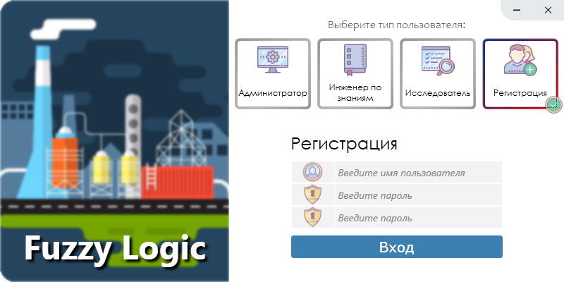

## Определение цветовых характеристик полимерных материалов (FuzzyLogic)

### Стек технологий:
- #### Паттерны: 
  > ООП, DI, IoC, UoW, DTO
- #### Технологии (.NET Core 3.1): 
  > WPF, EF Core (SQLite), NUnit (SQLite in memory)
- #### Дополнительно:
  > Локализация (ru, en, de), нестандартный дизайн